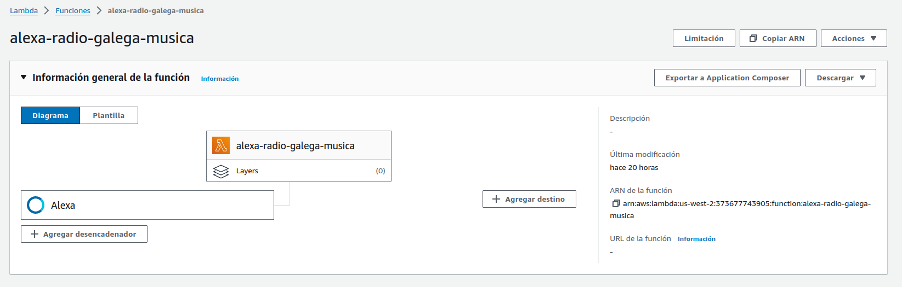

# Backend skill Radio Galega Música

Backend para la skill de alexa de Radio Galega Música usando Kotlin y AWS Lambda.

## Despliegues en AWS

## Como complicar 

Compilar:

`./gradlew build
`

Compilar con dependencias dentro:

`./gradlew build shadowJar
`
